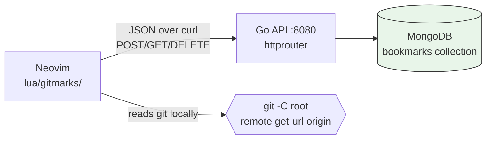
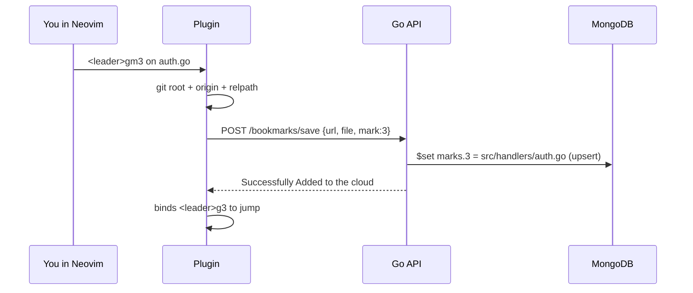
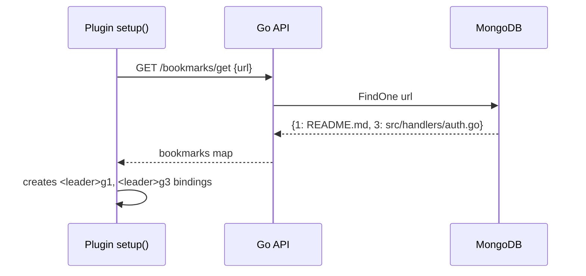

# GitMarks

Project-scoped Neovim marks that follow you (and your team) through the cloud.

You know that feeling? You mark the important files in a repo — API entrypoint, tricky utils, that one config everyone forgets — and then you switch laptops, or your teammate clones the same repo, and... all of it is gone. GitMarks fixes that.

---

## What is this?

GitMarks is two small pieces that work together:

1. **A Neovim plugin** (`lua/gitmarks/`) — lets you pin files to numbers `1-9` and jump back to them instantly.
2. **A Go backend** (`backend/`) + MongoDB — saves those pins in the cloud so anyone on the same repo gets the same marks.

The trick is simple: instead of keying marks by your local machine, GitMarks keys them by the repo's git `origin` URL and stores **relative** file paths. So `https://github.com/you/my-api` + mark `3` → `src/handlers/auth.go` works on every clone.

Think Harpoon, but shared.

## Why does this exist?

Built-in vim marks (`mA`, `` `A ``) and plugins like Harpoon are great, but they're **local-only**:

- New machine? Start over.
- Teammate joins? You have to Slack them "hey open src/x, then src/y...".
- Pairing / onboarding? No shared map of "where the important stuff lives".

GitMarks treats the important-files list as team knowledge, not editor state:

- Onboard faster: clone repo → open Neovim → your team's `1-9` map is already there.
- Stay in flow: `<leader>g3` jumps to the file, no fuzzy-finding the same 5 paths.
- One source of truth: mark it once, everyone sees it.

## How it works

### Big picture



The plugin never guesses which project you're in. Every action starts with: find `.git` upward → get `origin` → normalize to `https://github.com/...` → use that string as the cloud key.

Remote normalization (`lua/gitmarks/utils.lua`):

- `git@github.com:user/repo.git` → `https://github.com/user/repo`
- `ssh://git@github.com/user/repo.git` → `https://github.com/user/repo`
- strips trailing `.git`

### Save a mark



### Open Neovim / jump



Jumping itself is fully local after that: `root + relative_path` → `:edit`.

### What's in the repo?

```
lua/gitmarks/
  init.lua    → markFile(), openMarkedFile(), deleteMark(), openViewTab(), setup()
  utils.lua   → git root/remote detection, save/get/delete wrappers
  api.lua     → tiny curl JSON client (BASE_URL = http://localhost:8080)
  keymaps.lua → <leader>gm1-9, <leader>g1-9, <leader>gl
  ui.lua      → centered floating list (Enter open, d delete, q/Esc close)

backend/
  cmd/server/main.go                        → loads .env, connects DB, serves :8080
  internal/bookmarks/bookmarks.routers.go   → 3 routes
  internal/bookmarks/bookmarks.controllers.go
  internal/bookmarks/bookmarks.service.go
  internal/bookmarks/models/                → Bookmark {url, marks}, repository (Add/Delete/Get)
  internal/utils/                           → config, Mongo connect, JSON helpers
```

### Data + API

One Mongo document per repo:

```json
{
  "url": "https://github.com/you/my-api",
  "marks": { "1": "README.md", "3": "src/handlers/auth.go" }
}
```

| Method | Endpoint | Body | What it does |
|---|---|---|---|
| `POST` | `/bookmarks/save` | `{url, file, mark}` | Upserts `marks.<n>` |
| `GET` | `/bookmarks/get` | `{url}` | Returns all marks for repo |
| `DELETE` | `/bookmarks/delete` | `{url, mark}` | `$unset`s `marks.<n>` |

---

## How to run it

You'll run the backend once (locally or on a server), then install the plugin.

### 1. Backend

Prereqs: Go 1.27+, a MongoDB URI.

```bash
cd backend
# create a .env file with:
# MONGODB_URI=mongodb+srv://...
# MONGODB_DATABASE=gitmarks

go mod download
go run ./cmd/server/main.go
# Server listening on http://localhost:8080
```

> If your plugin and backend are on different machines, change `BASE_URL` in `lua/gitmarks/api.lua` from `http://localhost:8080` to your server URL.

### 2. Neovim plugin

With `lazy.nvim`:

```lua
{
  "SplinterSword/gitmarks",
  config = function()
    require("gitmarks").setup()
  end,
}
```

`setup()` fetches this repo's marks from the cloud immediately and creates jump keymaps for any marks it finds. If the repo has never been marked, you'll just see "No marks found for this repo" — totally fine, you're the first.

Requirements: Neovim 0.10+ (uses `vim.system` + `vim.fs`), git, `curl`, and an `origin` remote.

### 3. Daily use

| Keys | Action |
|---|---|
| `<leader>gm1` … `<leader>gm9` | Mark current file as 1-9 (saves to cloud) |
| `<leader>g1` … `<leader>g9` | Jump to marked file |
| `<leader>gl` | Open floating list of this repo's marks |

Inside the list (`lua/gitmarks/ui.lua`):

- `Enter` — open that file
- `d` — delete mark (local + cloud)
- `q` / `Esc` — close

Typical flow:

1. Open `src/handlers/auth.go`, hit `<leader>gm3` → "Mark saved to cloud".
2. Teammate opens same repo → `setup()` already pulled mark `3`.
3. Either of you hits `<leader>g3` or `<leader>gl` → `Enter`.

---

## Current limits (honest version)

- Only numbers `1-9`, only GitHub-style remotes, and you **need** an `origin` remote — no remote, no marks.
- No auth yet: anyone with your backend URL can read/write marks. Don't expose it publicly as-is.
- Backend is hardcoded to `:8080` and plugin to `localhost` — fine for local dev, you'll want env config for real team use.
- `GET /bookmarks/get` uses a JSON body on a GET request, which some proxies/tools dislike. `curl` handles it, browsers may not.

Good next steps would be: auth per team, configurable server URL, and branch-scoped marks.

---

## Contributing

PRs welcome. Easiest wins right now: making `BASE_URL` configurable, adding auth, and handling non-GitHub remotes. Just keep the plugin dependency-free (curl + stock Neovim APIs) if you can.
