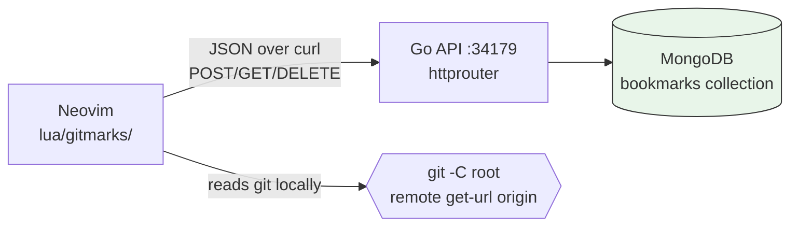
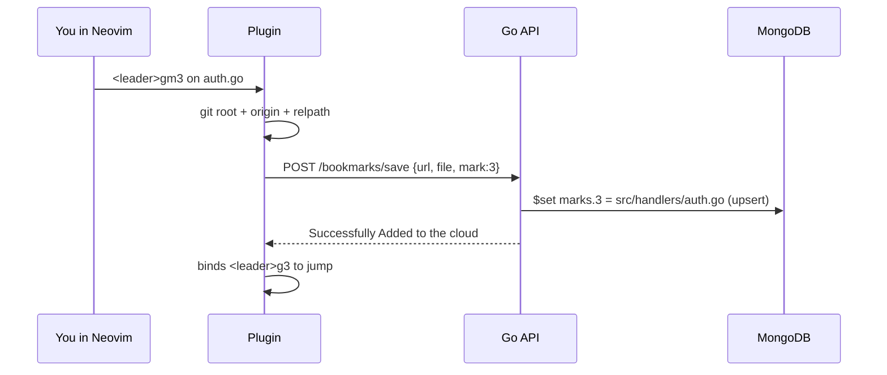
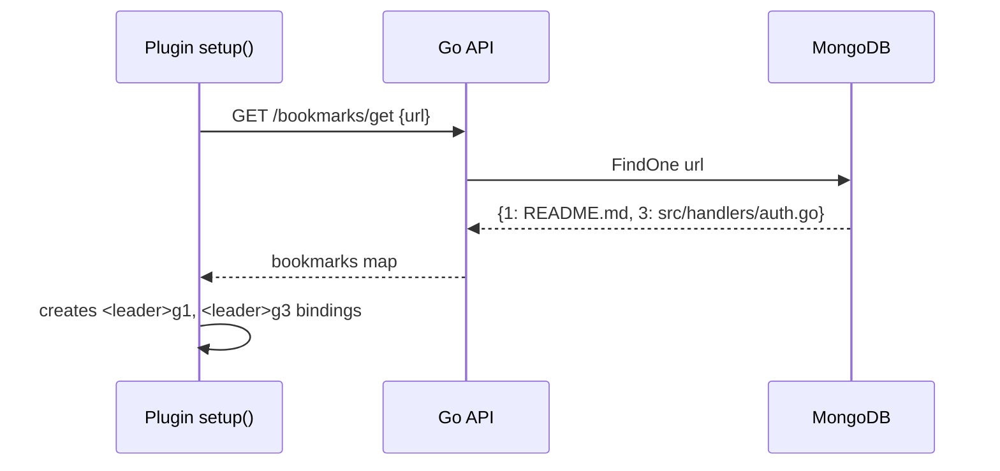

# GitMarks

GitMarks is a Neovim plugin with a Go + MongoDB backend for pinning files to keys `1-9` and sharing them across every clone of a repo.


<!-- Replace docs/demo.gif with real recording: <leader>gm3 save, <leader>g3 jump, <leader>gl list -->

## What is this?

You know that feeling? You mark the important files in a repo — API entrypoint, tricky utils, that one config everyone forgets — and then you switch laptops, or your teammate clones the same repo, and... all of it is gone. GitMarks fixes that.

GitMarks is two small pieces that work together:

1. **A Neovim plugin** (`lua/gitmarks/`) — lets you pin files to numbers `1-9` and jump back to them instantly.
2. **A Go backend** (`backend/`) + MongoDB — saves those pins in the cloud so anyone on the same repo gets the same marks.

The trick is simple: instead of keying marks by your local machine, GitMarks keys them by the repo's git `origin` URL and stores **relative** file paths. So `https://github.com/you/my-api` + mark `3` → `src/handlers/auth.go` works on every clone.

Think Harpoon, but shared.

## Motivation

Repo navigation knowledge is lost on every fresh clone — built-in vim marks and Harpoon are local-only, so teams re-find the same entrypoints and re-explain the layout for each new machine and teammate.

- Shared context: marks keyed by git `origin` URL + relative paths, not local state.
- Faster onboarding: clone repo, team `1-9` map is already there.
- Stay in flow: jump directly instead of fuzzy-finding the same files.

## 🚀 Quick Start

Prereqs: Neovim 0.10+, git with an `origin` remote, Docker + MongoDB URI.

### 1. Clone the repo

```bash
git clone https://github.com/SplinterSword/gitmarks
cd gitmarks
```

### 2. Start the backend

```bash
cd backend
docker build -t gitmarks-backend .
docker run -d --name gitmarks \
  --restart unless-stopped \
  -p 34179:34179 \
  -e MONGODB_URI="mongodb+srv://..." \
  -e MONGODB_DATABASE="gitmarks" \
  gitmarks-backend
```

Stays up across login/reboot. If stopped, restart with `docker start gitmarks`.

### 3. Install the plugin

```lua
local plugin_path = vim.fn.expand 'Location of The Clone Repo'

vim.opt.rtp:prepend(plugin_path)

local gitmarks = require 'gitmarks'

gitmarks.setup()
```

### 4. Mark and jump

- `<leader>gm1` — mark current file as `1`
- `<leader>g1` — jump to mark `1`
- `<leader>gl` — list this repo's marks

See `## How to run it` below for local Go setup, server URL config, and daily use.

## Usage

Available keymaps (normal + visual):

- `<leader>gm1` … `<leader>gm9` — mark current file as `1-9`, saves to cloud and creates the jump binding
- `<leader>g1` … `<leader>g9` — jump to marked file for the current repo
- `<leader>gl` — open floating list for the current repo

Floating list (`Enter` / `d` / `q`):

- `Enter` — open selected file
- `d` — delete mark locally and in the cloud
- `q` / `Esc` — close

Behavior notes:

- Marks are scoped by normalized git `origin` URL and stored as relative paths (`root + relpath` on jump).
- Valid marks are `1-9`; re-marking a number overwrites it.
- `setup()` pulls the repo map on startup and creates `<leader>g<n>` bindings for existing marks.

## Examples

Mark the current file as `3` and jump back to it:

```vim
" open src/handlers/auth.go, then:
<leader>gm3
" later, from anywhere in the same repo:
<leader>g3
```

Browse and manage marks:

```vim
<leader>gl
" Enter - open | d - delete | q/Esc - close
```

Available API endpoints:

- `POST /bookmarks/save` — body `{url, file, mark}`
- `GET /bookmarks/get` — body `{url}`
- `DELETE /bookmarks/delete` — body `{url, mark}`

```bash
# Save mark 3
curl -X POST http://localhost:34179/bookmarks/save \
  -H 'Content-Type: application/json' \
  -d '{"url":"https://github.com/you/my-api","file":"src/handlers/auth.go","mark":3}'

# Get all marks for a repo
curl -X GET http://localhost:34179/bookmarks/get \
  -H 'Content-Type: application/json' \
  -d '{"url":"https://github.com/you/my-api"}'

# Delete mark 3
curl -X DELETE http://localhost:34179/bookmarks/delete \
  -H 'Content-Type: application/json' \
  -d '{"url":"https://github.com/you/my-api","mark":3}'
```

## How it works

### Big picture



The plugin never guesses which project you're in. Every action starts with: find `.git` upward → get `origin` → normalize to `https://github.com/...` → use that string as the cloud key.

Remote normalization (`lua/gitmarks/utils.lua`):

- `git@github.com:user/repo.git` → `https://github.com/user/repo`
- `ssh://git@github.com/user/repo.git` → `https://github.com/user/repo`
- strips trailing `.git`

### Save a mark



### Open Neovim / jump



Jumping itself is fully local after that: `root + relative_path` → `:edit`.

### What's in the repo?

```
lua/gitmarks/
  init.lua    → markFile(), openMarkedFile(), deleteMark(), openViewTab(), setup()
  utils.lua   → git root/remote detection, save/get/delete wrappers
  api.lua     → tiny curl JSON client (BASE_URL = http://localhost:34179)
  keymaps.lua → <leader>gm1-9, <leader>g1-9, <leader>gl
  ui.lua      → centered floating list (Enter open, d delete, q/Esc close)

backend/
  cmd/server/main.go                        → loads .env (optional), connects DB, serves $PORT (default 34179)
  Dockerfile                                → multi-stage build (golang:1.27-alpine → distroless nonroot, ~22MB)
  .dockerignore                             → excludes .git, .env, .lazycurl
  internal/bookmarks/bookmarks.routers.go   → 3 routes
  internal/bookmarks/bookmarks.controllers.go
  internal/bookmarks/bookmarks.service.go
  internal/bookmarks/models/                → Bookmark {url, marks}, repository (Add/Delete/Get)
  internal/utils/                           → config, Mongo connect, JSON helpers
```

## 🤝 Contributing

### Clone the repo

```bash
git clone https://github.com/SplinterSword/gitmarks
cd gitmarks
```

### Backend local dev

```bash
cd backend
cp .env.example .env  # fill in MONGODB_URI / MONGODB_DATABASE, PORT optional
go mod download
go run ./cmd/server/main.go
```

### Plugin local dev

Point `lazy.nvim` at your checkout and exercise it in a repo with an `origin` remote:

```lua
local plugin_path = vim.fn.expand 'Location of The Clone Repo'

vim.opt.rtp:prepend(plugin_path)

local gitmarks = require 'gitmarks'

gitmarks.setup()
```

Then test `<leader>gm1` / `<leader>g1` / `<leader>gl`. Keep the plugin dependency-free (curl + stock Neovim APIs).

### Run checks

```bash
cd backend
go vet ./...
go test ./...
```

### Submit a pull request

Fork the repo and open a PR to `main`.
